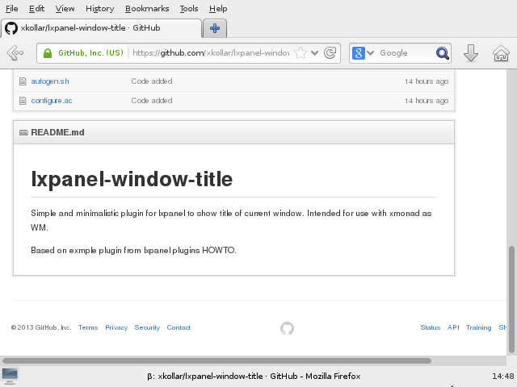

lxpanel-window-title
====================

Simple and minimalistic plugin for lxpanel to show title of current window.
Intended for use with xmonad as WM.

Based on exmple plugin from lxpanel plugins HOWTO.

Minimal `xmonad.hs` to work with lxpanel and lxpanel-window-title:

    module Main ( main ) where

    import XMonad
    import XMonad.Config.Desktop ( desktopConfig )
    import XMonad.Hooks.ManageDocks ( manageDocks )

    main :: IO ()
    main = xmonad $ desktopConfig
        { manageHook = manageDocks <+> manageHook desktopConfig
        }
